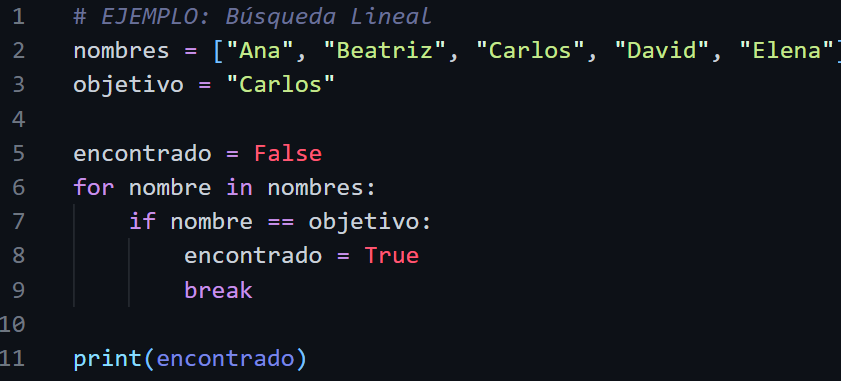
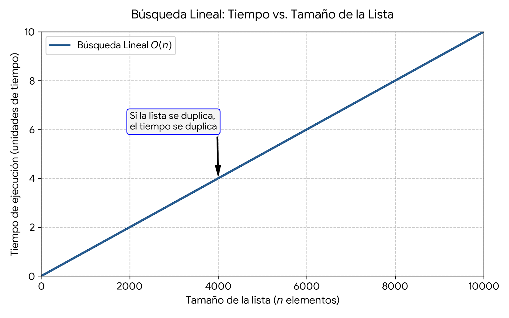
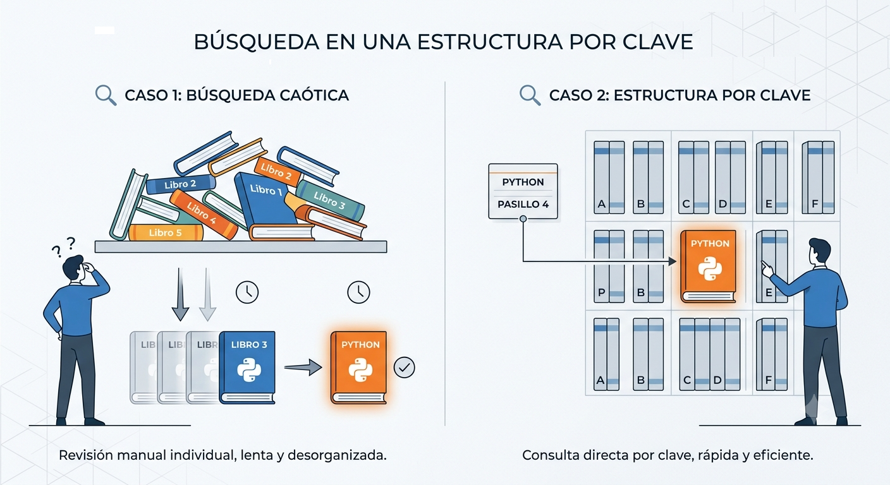

# Búsqueda Lineal

La **búsqueda lineal** consiste en revisar los elementos de una lista **uno por uno**, desde el inicio hasta el final, hasta encontrar el elemento buscado o comprobar que no existe.

Imagina que tienes una lista de nombres desordenada y quieres saber si **"Carlos"** se encuentra en ella.



> **Importante**
>
> El programa no adivina ni salta posiciones. Comienza comparando el primer elemento (posición `0`), luego el segundo (posición `1`), después el tercero (posición `2`) y así sucesivamente hasta encontrar el dato o llegar al final de la lista.

El tiempo que tarda este algoritmo crece de forma **lineal** con respecto al tamaño de la lista.

Si la lista contiene **n** elementos, en el peor de los casos será necesario realizar **n comparaciones**.

## 

### Qué NO es una Búsqueda Lineal

Un método que no es lineal es la búsqueda binaria (o usar un diccionario/conjunto con acceso directo). Para que no sea lineal, el algoritmo suele descartar varios elementos a la vez en lugar de ir uno por uno.

```python
# EJEMPLO DE LO QUE NO ES: Búsqueda Binaria (Requiere lista ordenada)
numeros = [10, 20, 30, 40, 50, 60, 70, 80, 90]
objetivo = 70

# En lugar de ir uno por uno, va directo al MEDIO (50)
# Como 70 > 50, descarta de golpe toda la mitad izquierda [10, 20, 30, 40, 50]
# Y solo busca en la mitad derecha.
```

# Búsqueda en un Diccionario

Los **diccionarios** funcionan de manera diferente a las listas.

Mientras que en una lista es necesario recorrer los elementos para encontrar uno específico, en un diccionario se accede directamente mediante su **clave (key)**.

Esto hace que las búsquedas sean mucho más rápidas en la mayoría de los casos, ya que Python utiliza una estructura interna llamada **tabla hash (hash table)** para localizar los elementos.

Por ejemplo, si un diccionario almacena información de estudiantes utilizando su documento de identidad como clave, no es necesario recorrer todos los registros para encontrar uno en particular. Basta con indicar la clave correspondiente.



## Ejemplo

```python
estudiantes = {
    "1001": "Ana",
    "1002": "Carlos",
    "1003": "Laura"
}

codigo = "1002"

if codigo in estudiantes:
    print("Estudiante encontrado:", estudiantes[codigo])
else:
    print("El estudiante no existe.")
```

**Salida**

```text
Estudiante encontrado: Carlos
```

En este ejemplo no se recorren todos los elementos del diccionario. Python utiliza la clave (`"1002"`) para acceder directamente al valor asociado, haciendo que la búsqueda sea mucho más eficiente que una búsqueda lineal sobre una lista.

## Comparación de Eficiencia entre Búsqueda Lineal y Búsqueda en Diccionarios

```python
import time

# --- PREPARACIÓN DE DATOS ---
NUM_ELEMENTOS = 1_000_000
# El elemento a buscar estará al final para evaluar el peor caso de la lista
OBJETIVO = "elemento_999999"

print(" Creando estructuras de datos...")
# Lista desordenada
lista_datos = [f"elemento_{i}" for i in range(NUM_ELEMENTOS)]

# Diccionario (Hash Map)
diccionario_datos = {f"elemento_{i}": True for i in range(NUM_ELEMENTOS)}

print("✓ Estructuras creadas con éxito.\n")


# --- 1. BÚSQUEDA LINEAL EN LISTA DESORDENADA ---
inicio = time.perf_counter()

# Búsqueda en la lista (recorre uno por uno)
encontrado_lista = OBJETIVO in lista_datos

fin = time.perf_counter()
tiempo_lista = fin - inicio


# --- 2. BÚSQUEDA DIRECTA EN DICCIONARIO ---
inicio = time.perf_counter()

# Búsqueda en el diccionario (acceso por clave)
encontrado_dicc = OBJETIVO in diccionario_datos

fin = time.perf_counter()
tiempo_dicc = fin - inicio


# --- RESULTADOS ---
print("=" * 45)
print(f" RESULTADOS DE BÚSQUEDA ({NUM_ELEMENTOS:,} elementos)")
print("=" * 45)
print(f"Lista (Búsqueda Lineal):   {tiempo_lista:.6f} segundos")
print(f"Diccionario (Tabla Hash):  {tiempo_dicc:.6f} segundos")
print("-" * 45)

if tiempo_dicc > 0:
    diferencia = tiempo_lista / tiempo_dicc
    print(f"¡El diccionario fue {diferencia:,.0f} veces más rápido!")

```

# Proyecto de consolidación

## Gestión de Inventario

Una tienda necesita un sistema que le permita administrar la información de sus productos. El sistema deberá registrar nuevos productos, consultarlos, mostrar el inventario disponible y verificar las categorías existentes.

---

## Clases

### Clase `Producto`

Cada producto debe almacenar la siguiente información:

- Código
- Nombre
- Precio
- Categoría

---

### Clase `Inventario`

Esta clase será la encargada de administrar el inventario de la tienda y deberá permitir:

- Agregar nuevos productos.
- Buscar un producto por su código.
- Mostrar todos los productos registrados.
- Consultar un producto a partir de su código.
- Verificar si una categoría existe en el inventario.

---

## Interfaz de Consola

El programa deberá presentar el siguiente menú:

```text
=============================
GESTIÓN DE INVENTARIO
=============================

1. Agregar producto
2. Buscar producto por código
3. Consultar producto por código
4. Verificar categoría
5. Mostrar productos
6. Salir
```

El menú deberá repetirse hasta que el usuario seleccione la opción **Salir**.
